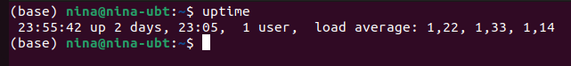
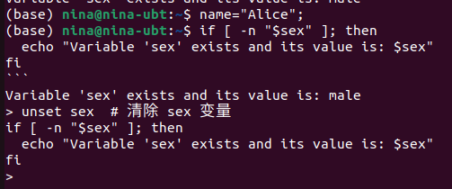
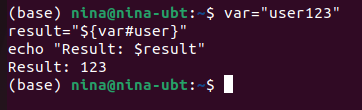
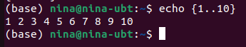
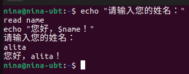
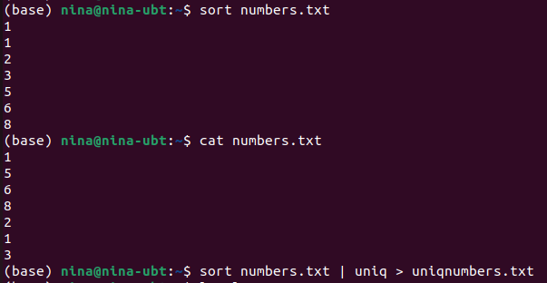
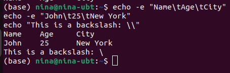
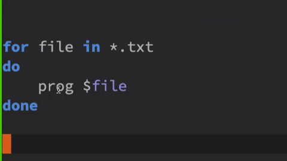

# Lesson 1

See ‘man readline‘ for all the default keybindings in Bash.

Shortcut:
- Ctrl+k #kill rest of the line
- Ctrl+u # 与Ctrl+k相反
- Ctrl+y paste what just killed
- Ctrl+r search the command history

# The Art of Command Line
man-the system's manual pager
e.g. 语法 man section command
```bash
man 1 ls 
```
## history
Ctrl+r
ctrl-r to search through command history.
press ctrl-r repeatedly to cycle through more matches, press Enter to execute the found command.

If you are halfway through typing a command but change your mind, hit alt-# to add a # at the beginning and enter it as a comment 

## xargs
基本用法：使用 xargs 将输入作为参数传递给命令
```bash
echo "file1 file2 file3" | xargs ls #列出当前目录下的 file1、file2 和 file3
```
```bash
cat file_list.txt | xargs rm 
```
## 其他：
1. {} 的简单用法通常是用作占位符，用于在命令中替换具体的值。
假设有一个文件包含一些文件名的文本文件files.txt,内容如下
file1.txt
file2.txt
file3.txt
使用 {} 来批量操作这些文件，比如复制它们到另一个目录：
```bash
cat files.txt | xargs -I{} cp {} /path/to/destination/ #I选项 replace-str
```
2. `pstree -p` is a helpful display of the process tree
Know the various signals you can send processes. For example, to suspend a process, use `kill -STOP [pid]`. For the full list, see `man 7 signal`
Use `nohup` or `disown` if you want a background process to keep running forever.
3. Check what processes are listening via `ss -plat`.
4. using uptime to know how long the system has been running


5. Use `alias` to create shortcuts for commonly used commands. For example:
```bash
alias ll='ls -latr' #creates a new alias ll
#Save aliases, shell settings, and functions you commonly use in ~/.bashrc, and arrange for login shells to source it. 
```
6. Synchronize your configuration files (e.g. .bashrc) among various computers with Git.

7. `ls -al`显示所有文件,包括隐藏文件
8. set一系列用法：In Bash scripts, use set -x (or the variant set -v, which logs raw input, including unexpanded variables and comments) for debugging output. 
```bash
set -e

if [ $# -eq 0 ]; then
    echo "Usage: $0 [arguments]"
    exit 1
fi

# Rest of the script
```

9. variable expression
```bash
num1=5
num2=10

result=$((num1 + num2))

echo "The result of the expression is: $result"
```
10. variable expansion变量扩展
- checking a variable exists
```bash
# 定义变量 name
name="Alice"
sex="male" #注意变量赋值的时候不能有空格
# 检查变量 sex 是否存在，如果存在则输出，否则不执行
if [ -n "$sex" ]; then
  echo "Variable 'sex' exists and its value is: $sex"
fi
```

Note:如果之前的消息中，有一条命令 sex="male"，它将变量 sex 设置为 "male"。这个命令执行后，Shell会记住这个变量，即使您在之后的消息中没有重新定义它。解决方法是`unset sex`

- Using a default value if a variable is empty: ${name:-default}
- Arithmetic expansion: i=$(( (i + 1) % 5 ))
- Sequences: {1..10}
- Trimming of strings: `${var%suffix} and ${var#prefix}`
```bash
var="user123"
result="${var#user}" #删除前缀
echo "Result: $result"
```



11. Brace expansion using {...}
`mv foo.{txt,pdf} some/dir/`


12. The order of expansions is: brace expansion; tilde expansion, parameter and variable expansion, arithmetic expansion, and command substitution (done in a left-to-right fashion); word splitting; and filename expansion. 
Note:`cd ~` tilde:波浪号的扩展用法
e.g. A range like {1..20} cannot be expressed with variables using {$a..$b},use seq or a for loop instead:
使用seq命令
    ```bash
    a=1
    b=20
    range=$(seq $a $b)
    echo $range
    ```
    或者使用for循环
    ```bash
    a=1
    b=20
    for ((i=a; i<=b; i++)); do
        echo $i
    done
    ```
13. The output of a command can be treated like a file via <(some command). 使用 <() 来将命令的输出视为文件，这种操作称为"进程替代"（Process Substitution）.
    ```bash
    sort <(cat input.txt) > sorted_output.txt```
    ```
    Note:`cat` 命令读取 input.txt 文件的内容，然后使用进程替代 `<()` 将该命令的输出视为文件。然后，我们使用 sort 命令对这个虚拟文件进行排序，并将结果保存到 sorted_output.txt 文件中，而无需创建实际的中间文件。


14. 如何定义一个简单的函数：
    ```bash
    greet () {
        local name="$1"  # 将传递的参数（名字）存储在名为 name 的局部变量中
        echo "Hello, $name!"  
    }
    ```


    ```bash
    greet "Alice"
    ```
    read用法：
    ```bash
    echo "请输入您的姓名："
    read name
    echo "您好，$name！"
    ```
    

15. `less` 和 `cat` 都是用于查看文本文件内容的命令行工具，但它们在功能和用途上有一些区别：
less 允许您按页浏览文件，支持向前和向后翻页，因此适用于查看大型文本文件，而无需一次性将整个文件内容加载到屏幕上。
less 提供了交互性，您可以使用键盘命令来浏览、搜索和跳转文件内容。
less 具有搜索功能，可以在文件中搜索特定文本，使用 / 键启动搜索。
16. Use `screen` or `tmux` to multiplex the screen.
tmux是一个终端复用器terminal multiplexer
典型例子：ssh登陆远程计算机，打开一个远程窗口执行命令，这时网络突然断线，再次登陆找不回上一次的执行命令的，因为上一次ssh会话已经终止，里面的进程也随之消失了。为了解决这个问题，会话与窗口解绑。
第一个启动的会话编号是0,以此类推,也可以自定义session name 
```bash
tmux new -s <session-name>
```
session management:
`tmux detach`#执行命令后，会退出当前tmux窗口，但是会话和里面的进程仍然后台运行。
`tmux ls`#查看所有会话
`tmux attach` #接入会话
```bash
tmux attach -t 0
#or
tmux attach -t<session-name>
```
`tmux kill -session -t 0` #kill session
`tmux switch -t 0` #切换session
`tmux rename-session -t 0 <new-name>`
`tmux split-window` #划分window
`tmux select-pane -U`#移动光标到上方窗格
`tmux swap-pane -U`#交换窗格位置
`tmux new-window`#创建新窗口
`tmux list-keys`#列出快捷键
`tmux list-comands`#列出tmux的命令信息

## Processing files and data

Know about `wc` to count newlines (-l), characters (-m), words (-w) and bytes (-c).

Use `zless`, `zmore`, `zcat`, and `zgrep` to operate on compressed files.

## System debugging
"socket" 指的是计算机网络通信中的套接字（socket）。套接字是用于在计算机网络上建立通信连接的一种机制，它包括了IP地址和端口号，用于标识网络中的两个进程之间的通信。

Pretty-print two JSON files, normalizing their syntax, then coloring and paginating the result:
    diff <(jq --sort-keys . < file1.json) <(jq --sort-keys . < file2.json) | colordiff | less -R

Summing all numbers in the third column of a text file (this is probably 3X faster and 3X less code than equivalent Python):
```bash
awk '{ x += $3 } END { print x }' myfile
```

```bash
awk '{print $2}' file.txt #打印文件 file.txt 的每一行的第二列
```

```bash
awk '{sum += $1} END {print sum}' file.txt #计算文件 file.txt 中第一列的总和
```
```bash
awk '/pattern/ {print}' file.txt #查找并打印匹配的行
```

```bash
awk -F',' '{print $2}' file.csv #使用逗号作为字段分隔符，打印 CSV 文件 file.csv 的第二个字段
```
A shell is simply a macro processor that executes commands


## Exercise 1:
```bash
quota () {
echo "Disk quotas for user jlento (uid 8520): 
     Filesystem  blocks   quota   limit   grace   files   quota   limit   grace
/dev/mapper/rhel-tmp /tmp       0  1048576 2097152               1       0       0
/dev/mapper/local-scratch /local_scratch       0  83886080 104857600               5       0       0"
}
export -f quota
```
The export -f quota command is used to export the quota function to the environment. When you export a function using export -f, it becomes available not only in the current shell but also in any child processes or subshells that are spawned from the current shell session.

trap:In Bash, the trap command is used to set up signal handling, allowing you to specify what should happen when a particular signal is received by the shell.
escape sequence
\n：表示换行字符，将文本移到下一行。
\t：表示制表符，通常用于在文本中创建水平制表。
\\: Treat the second backslash as a plain backslash character itself.
e.g. 
```bash
echo -e "Name\tAge\tCity" #-e stands for escape sequence
echo -e "John\t25\tNew York"
echo "This is a backslash: \\"
```



```bash
echo *.txt | xargs -n 1 -P $SLURM_NUM_CPUS programme
```
